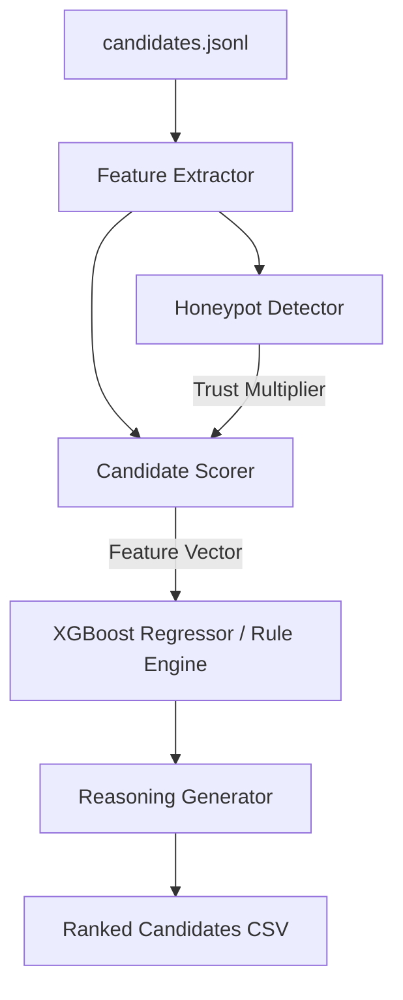

# Redrob Candidate Ranking System 🚀

An advanced, production-grade candidate ranking pipeline designed to evaluate, score, and rank candidates for the **Senior AI Engineer** role at Redrob.

The system utilizes a multi-dimensional ranking algorithm combined with an **XGBoost Regression model** to predict candidate fit. It incorporates robust profile verification (Honeypot Detection) to filter out suspicious profiles, ensuring high trust and data quality.

---

## 📋 Table of Contents
1. [System Architecture](#-system-architecture)
2. [Ranking Methodology & Weights](#-ranking-methodology--weights)
3. [Component Breakdown](#-component-breakdown)
4. [Getting Started & Installation](#-getting-started--installation)
5. [Usage Instructions](#-usage-instructions)
6. [Reproducibility & Performance](#-reproducibility--performance)

---

## 🏗️ System Architecture

The ranking pipeline consists of several modular components that handle everything from data parsing to feature normalization, ML scoring, and fact-based reasoning generation.



### File Structure:
*   [rank.py](file:///e:/redrob-hackathon/rank.py): The main pipeline execution script. Ranks candidates using either the ML model or a rule-based fallback.
*   [train_model.py](file:///e:/redrob-hackathon/train_model.py): Trains the XGBoost Regressor model on candidate features normalized by a standard scaler.
*   [scorer.py](file:///e:/redrob-hackathon/scorer.py): Calculates individual feature component scores and produces final candidates' fits.
*   [feature_extractor.py](file:///e:/redrob-hackathon/feature_extractor.py): Normalizes and extracts nested profile structures (history, skills, education, platform signals, years of experience).
*   [honeypot_detector.py](file:///e:/redrob-hackathon/honeypot_detector.py): Scans for fraudulent profiles and outputs a trust multiplier.
*   [job_description.py](file:///e:/redrob-hackathon/job_description.py): Contains the target job description details, target locations, company preferences, keyword dictionaries, and title weights.

---

## ⚖️ Ranking Methodology & Weights

Candidates are graded based on **7 weighted professional dimensions** designed to identify top AI/ML talent:

| Dimension | Weight | Target Criteria / Highlights |
| :--- | :--- | :--- |
| **Title Relevancy** | 20% | Prefers "AI Engineer", "ML Engineer", "Search/Relevance Engineer", "Applied Scientist". |
| **Career Fit** | 25% | Presence of deep technical evidence (ranking, recommendations, retrieval, embeddings, vector search). |
| **Company Fit** | 10% | Prefers candidates with Product/Startup/SaaS backgrounds over pure consulting/IT outsource companies. |
| **Behavioral Signals** | 20% | Engagement metrics: Active search, high recruiter response rate, interview completion, and active GitHub. |
| **Location** | 5% | Located in or willing to relocate to target hubs (Noida, Pune, Delhi NCR, Gurgaon, Hyderabad, Mumbai). |
| **Experience** | 5% | 6–8 years of experience is optimized for the Senior role. |
| **Honeypot Detection** | *Multiplier* | Restricts overall score if a profile shows high risk or anomaly markers. |

---

## 🛡️ Honeypot Detection & Risk Mitigation

Fake profiles or resume-boosting patterns are penalized using a **Trust Multiplier** ($0.3 \le \text{trust} \le 1.0$), which multiplies the final weighted score:
1.  **Experience Mismatch**: If a candidate claims a "Senior" title but has $< 4$ years of experience $\rightarrow$ **$50\%$ trust penalty** ($\times 0.5$).
2.  **Keyword Stuffing / Empty History**: If $> 80\%$ of skills are AI/ML-related but the candidate has no career history listed $\rightarrow$ **$60\%$ trust penalty** ($\times 0.4$).
3.  **No Experience**: Candidates with 0 total years of experience $\rightarrow$ **$40\%$ trust penalty** ($\times 0.6$).

---

## ⚙️ Getting Started & Installation

### Prerequisites
*   Python 3.12 (recommended) or 3.10+
*   Virtual environment tool (`venv` or `conda`)

### Setup Instructions

1.  **Clone and navigate to the project directory:**
    ```bash
    cd redrob-hackathon
    ```

2.  **Create and activate a virtual environment:**
    *   **Linux/macOS:**
        ```bash
        python3 -m venv venv
        source venv/bin/activate
        ```
    *   **Windows:**
        ```powershell
        python -m venv venv
        .\venv\Scripts\activate
        ```

3.  **Install dependencies:**
    ```bash
    pip install -r requirements.txt
    ```

---

## 🚀 Usage Instructions

### 1. Training the XGBoost Ranking Model
To train the XGBoost Regressor model on your candidate dataset:
```bash
python train_model.py
```
This script will:
*   Extract features and calculate target scores from `candidates.jsonl`.
*   Normalize the features using scikit-learn's `StandardScaler`.
*   Split the dataset into an 80/20 train/test split.
*   Train the XGBoost Regressor model and print the feature importances.
*   Save the model to `ranking_model.pkl` and the scaler to `scaler.pkl`.

### 2. Running Candidate Ranking
You can run candidate evaluation and ranking using either the trained ML model (default) or purely rule-based logic.

*   **Using the XGBoost ML Model (Default):**
    ```bash
    python rank.py --candidates candidates.jsonl --output team_pseudoclan.csv
    ```


### 3. Reviewing Results
The output file is saved as a structured CSV containing candidate rankings, scores, normalized education/skills/location/experience, and a generated **fact-based reasoning sentence** limited to 160 characters.

```bash
# View the top 10 ranked candidates
head -11 team_pseudoclan.csv
```

---

## ⚡ Reproducibility & Performance

*   **Total Candidates Evaluated:** 100,000
*   **Ranked Output Limit:** Top 100 candidates
*   **Expected Execution Time:** ~65 seconds for 100,000 candidates (CPU-only execution, fast batch processing)
*   **Memory Utilization:** 2–3 GB RAM
*   **Target Output File:** `team_pseudoclan.csv`
*   **ML R² Metrics:** Evaluated during training phase in stdout
